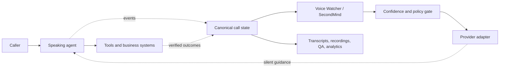

<p align="center">
  
</p>

# Supafone Labs

**Production infrastructure for voice agents that need to work after the demo.**

[Python SDK](https://pypi.org/project/supafone-labs/) ·
[TypeScript SDK](https://www.npmjs.com/package/supafone-labs) ·
[GitHub](https://github.com/samthedataman/supafone-labs) ·
[Developer console](https://labs.supafone.ai) ·
[API reference](https://api.labs.supafone.ai/docs)

## Why we built it

A voice demo can be assembled quickly. A dependable voice product cannot. The
production agent is split across a realtime model, telephony, TTS, STT, tools,
retrieval, state, recordings, compliance, monitoring, and post-call workflows.
Every vendor exposes a different event format, and the speaking model is still
expected to notice and correct its own mistakes while talking.

Supafone Labs was built around the failures that appear at those boundaries:

| Production problem | Supafone innovation | What changes for the developer |
| --- | --- | --- |
| The speaking agent must supervise itself | **Voice Watcher and SecondMind** run beside the call and issue one bounded directive only when evidence is strong | Add supervision without replacing the agent or extending the audio hot path |
| Every voice platform has different events and controls | **Canonical runtime plus 14 audited adapters** normalize call events and compile guidance into the control each platform actually supports | Keep the current provider and reuse the same supervision, QA, and telemetry |
| Prompts make operational claims that tools never confirmed | **Truth state and guardrail policies** track verified bookings, transfers, deliveries, consent, and failures separately from model language | Prevent the agent from claiming an action succeeded before a tool proves it |
| Every new agent starts as another prompt-engineering project | **Agent Factory** turns a job description into editable stages, tools, routing, numbers, voices, and artifacts | Provision complete inbound, outbound, browser, and campaign agents through one API |
| Testing is manual role-play | **Adversarial QA and SSR grading** generate scenarios from the agent objective and compare supervised with unsupervised behavior | Measure regressions and supervision lift before deployment |
| Calls disappear into provider dashboards | **Durable activity APIs** retain agents, plans, calls, recordings, transcripts, watcher events, and post-call outcomes | Build one operational console instead of reconciling vendor logs |
| Multilingual calls lose context or use the wrong voice | **Language-aware transcription and opt-in language/voice profiles** preserve the active workflow while the language changes | Configure multilingual behavior without rewriting the agent graph |
| Phone, WebRTC, SMS, campaigns, and signing become separate systems | **One SDK and one account model** connect managed delivery, messaging, campaigns, artifacts, and writebacks | Stop rebuilding the surrounding product for every customer |

## The architecture



The call never waits for the Watcher. If supervision is unavailable, late, or
uncertain, the gate emits no directive and the original agent continues.

## Two ways to use the package

### Supervise an agent you already run

```python
import supafone_labs

supervisor = supafone_labs.supercharge(my_agent)
result = await supervisor.observe(provider_event)
```

The package auto-detects supported agents when possible, normalizes their
events, and returns the provider-appropriate action. Start with
[Voice Watcher](self-healing-watcher.md), then check the
[framework coverage matrix](framework-support.md).

### Provision the complete agent

```ts
import { Supafone } from "supafone-labs";

const supafone = new Supafone({
  apiKey: process.env.SUPAFONE_TOKEN!,
  voiceWatcher: true,
});

const agent = await supafone.labs.agents.createInboundWithNumber({
  agentKey: "northline-intake",
  name: "Northline intake",
  description: "Understand the request and book the right next step.",
  number: { search: { areaCode: "415" } },
});
```

Agent Factory adds the plan, number, voice, stages, tools, call artifacts, and
Watcher. Developers can inspect and edit the generated plan before creation.

## Framework coverage

The release gate covers fourteen runtime integrations, not a marketing-only
logo list:

- **Native control:** Supafone Agent Factory, Ultravox, Vapi, OpenAI Realtime,
  Grok Voice Agent, Gemini Live, ElevenLabs Agents, Deepgram Voice Agent, and
  Inworld Realtime.
- **Context owned by the developer:** Retell custom LLM, LiveKit Agents, and
  Pipecat.
- **Observation or explicit hook:** Bland and Cartesia Line.
- **Extension path:** `GenericWebhookAdapter` for proprietary systems.

Integration depth is different for each provider. The
[complete framework matrix](framework-support.md) shows the exact control,
acceptance criterion, and managed-delivery status for every runtime.

## Package surfaces

| Surface | Use it for |
| --- | --- |
| Python | Local runtime, adapters, replay, supervision, STT/TTS components, and backend automation |
| TypeScript | Node, React, browser, Agent Factory, campaigns, activity, and product integrations |
| REST and WebSocket | Hosted agents, realtime services, events, recordings, transcripts, and custom clients |
| MCP | Agent creation, calls, QA, logs, and operational workflows from AI development tools |

## Start here

1. Read [the production problems](production-voice-ai-challenges.md).
2. Understand [Voice Watcher and SecondMind](self-healing-watcher.md).
3. Review [all supported frameworks](framework-support.md).
4. Install the [Python or TypeScript SDK](sdk-installation.md).
5. Follow the [quickstart](quickstart.md).
6. Choose [managed delivery or BYOK](byok-providers.md).
7. Run the [voice-agent QA workflow](voice-qa-landscape.md).

Supafone Labs exists so developers can define the caller experience, tools,
and safety policy while one framework handles the infrastructure around them.
