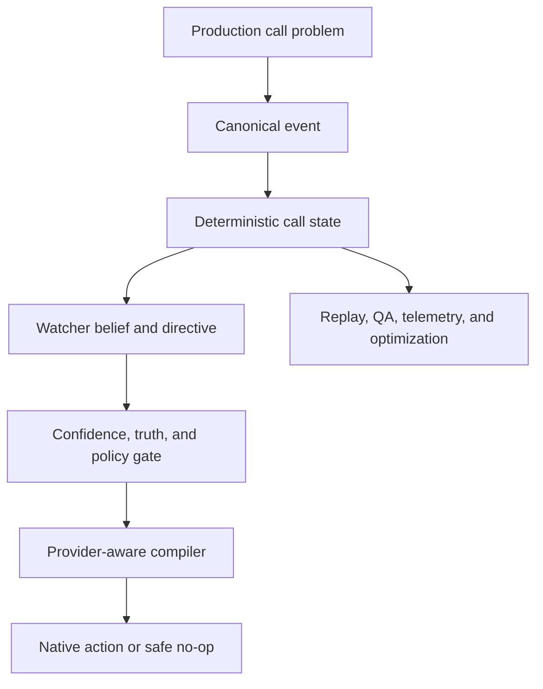

# Why Supafone

Supafone Labs exists because production voice agents fail at system boundaries,
not because developers need another prompt wrapper.

## Problems we repeatedly encountered

| Problem | Failure in production | Innovation in the package |
| --- | --- | --- |
| Self-supervision | The speaking model misses cross-turn intent, emotion, workflow drift, and unsupported claims | **Voice Watcher and SecondMind** maintain a separate belief and directive loop off the audio hot path |
| Provider fragmentation | Every platform emits different transcript, tool, lifecycle, and control events | **Canonical event algebra and 14 audited adapters** create one runtime contract |
| Weak intervention controls | A generic prompt cannot safely alter an active call | **Capability-aware compilation** chooses native control, developer-owned context, host hook, observation, or no action |
| Tool hallucination | The agent says a booking, transfer, or delivery happened before the tool confirms it | **Truth state** separates verified outcomes from conversational language |
| Repeated agent engineering | Every customer brief becomes another prompt, router, stage graph, and webhook project | **Agent Factory** creates an inspectable plan plus managed delivery primitives |
| Manual testing | A few employee test calls miss the scenarios real callers produce | **Objective-driven adversarial QA** generates cases from the actual agent contract |
| No stable quality score | Generic LLM scores fluctuate without an operational target | **SSR grading** converts nominal verdicts into inspectable score distributions |
| Scattered operations | Calls, recordings, transcripts, and decisions live in separate vendor consoles | **Durable activity APIs and telemetry** expose one history to SDKs and product UIs |
| Multilingual discontinuity | Language changes duplicate transcripts, lose state, or use the wrong voice | **Transcript-authority rules and opt-in language/voice profiles** preserve one canonical call |
| Rebuilt customer infrastructure | Phone, WebRTC, SMS, campaigns, numbers, signing, and writebacks are implemented repeatedly | **Unified SDK, REST, and MCP surfaces** expose the surrounding operating system |

## The design response

The architecture follows four rules:

1. **The live call remains primary.** Supervision never blocks the speaking
   agent.
2. **Facts and warmth remain separate.** Empathy cannot override tool truth,
   consent, or policy.
3. **Capability is explicit.** Supafone never pretends a provider supports a
   control it does not expose.
4. **Evidence drives improvement.** Calls can be replayed, graded, compared,
   and used to improve standing directives.

## What developers stop rebuilding

- Agent and stage planning
- Provider event normalization
- Mid-call supervision
- Truth and consent state
- TTS, STT, and telephony selection
- Phone and WebRTC delivery
- Recordings and transcripts
- Post-call classification
- Adversarial QA and grading
- Campaign, messaging, and artifact workflows
- Operational logs and activity APIs

Continue with [Framework coverage](framework-support.md) to see exactly how the
runtime maps onto each supported platform, then use the
[SDK quickstart](quickstart.md) to create or supervise an agent.
